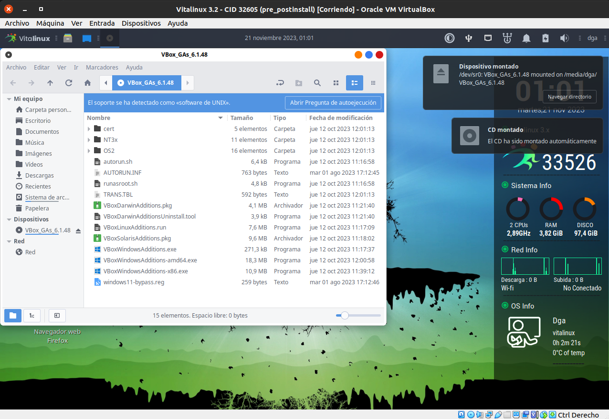
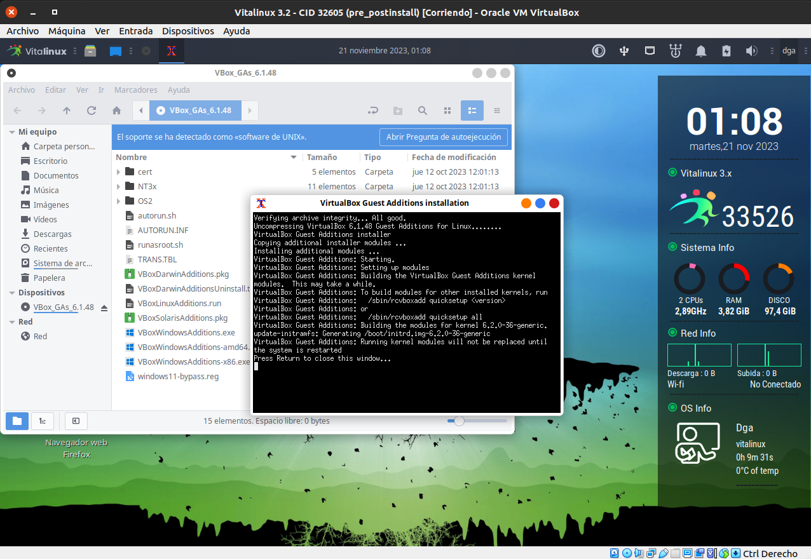

### Instalar las Guest Additions {#InstalarGuestAdditions}

Las Guest Additions son un conjunto de librerías y programas que podemos instalar en la máquina virtual (no en la real), para añadir funcionalidades extra, de forma que la experiencia en el manejo resulta mucho más enriquecida. De ésta forma podemos tener características como que la resolución de pantalla se ajusta al tamaño de ventana, mejor interacción entre la máquina virtual y la real...


Se recomienda, aunque no necesario, instalar el paquete software <b>dkms</b> en la máquina virtual <tt>Vitalinux</tt>, el cual se encargará de adecuar las librerías del sistema cuando se actualice el kernel o núcleo de nuestro <tt>Vitalinux</tt>.
 
Aunque puede instalarse más adelante, el que desee instalar el paquete <b>dkms</b> en este momento y no sepa como hacerlo, deberá dirigirse a la parte de gestión de software de <tt>Vitalinux</tt>.


Para ello debemos tener arrancada la máquina y clickar en la opción que hay en **VirtualBox de Dspositivos-&gt;Insertar Imágen de CD** de las Guest Additions. Éste menú puede cambiar si estamos trabjando en un sistema base de Microsoft.

La acción anterior lanzará un proceso en la máquina similar al de insertar un CD, donde tendremos el software a instalar.

Para instalarlo debemos **clickar donde indica Abrir Programa de autoejecución** el cual nos pedirá confirmación. Cuando clickemos en 2 (Ejecutar) el sistema nos pedirá credenciales del usuario dga o docente (administradores en ése momento si no has creado otros usuarios). La contraseña de dichos usuarios por defecto es **careidga**

Se lanzará el proceso de instalación y debermos esperar hasta que nos indique que podemos cerrarlo pulsando la tecla Intro.

Solo nos queda **reiniciar**.

Puedes encontrar un ejemplo de como instalar las Guest Addtions en un Vitalinux instalado como máquina virtual de VirtualBox en la píldora formativa de *Probando Vitalinux en un entorno virtual*:

https://youtu.be/A1oaYfYfV7U