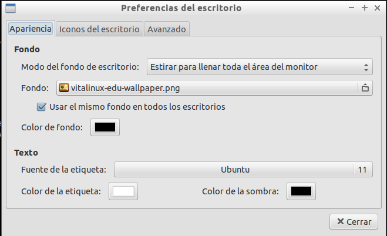
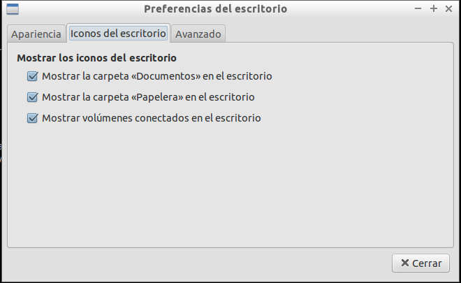

# Personalización de Vitalinux 2.x

## Contenido

Como ya se ha señalado en apartados anteriores, la forma de personalizar el entorno de Escritorio de tu Vitalinux depende de la versión de Vitalinux que estés usando.  A continuación se mostrará como personalizar la versión 2.x:

- [1 Personalización del Escritorio Vitalinux 2.x](#PersonalizacionEscritorioVitalinux)
- [2 Personalización del Panel Inferior](#PersonalizarPanelInferior)
- [3 Apariencia de Vitalinux](#PersonalizarApariencia)

## Personalización del Escritorio Vitalinux 2.x {#PersonalizacionEscritorioVitalinux}

Para poder personalizar el aspecto de nuestro Escritorio necesitamos editar las **Preferencias del Escritorio**: para ello pulsa **CONTROL+ESPACIO**, escribe ***preferencias del escritorio*** y confirma pulsando a la tecla **Intro**.  Podrás comprobar que desde la ventana que se te habrá abierto, en función de la pestaña que selecciones, tendrás la posibilidad de personalizar la imagen de fondo de Escritorio, el tipo y tamaño de la letra, los iconos de acceso a recursos (*papelera, carpeta Documentos, unidades de CD/DVD o USB que se conecten, etc.*), o el comportamiento del Escritorio.

## Personalización del Panel Inferior del Escritorio {#PersonalizarPanelInferior}

Otra opción de personalización del **Entorno de Escritorio** de <tt>Vitalinux</tt> es editar el **panel inferior**, o añadir uno nuevo para nuevas notificaciones.  Para editar el panel inferior será necesario pinchar con el botón derecho del ratón sobre el panel inferior (*sobre el área gris del panel*) y elegir _**Configuración del panel**_.  En el caso de que queramos añadir un panel nuevo seleccionaremos _**Crear un panel nuevo**_.  Entre las diferentes opciones de configuración del panel que encontrarás, destacaríamos la posibilidad de elegir <b>la posición del panel</b>, <b>su tamaño</b>, <b>su apariencia</b>, etc.


Personalización del Panel Inferior de Vitalinux



Opciones de Personalización del Panel Inferior de Vitalinux


## Personalización de la Apariencia y Comportamiento de las Ventanas {#PersonalizarApariencia}

Otro aspecto que nos puede interesar a la hora de personalizar nuestro Entorno en <tt>Vitalinux</tt> es la <b>Apariencia y Comportamiento de las Ventanas</b>.  En concreto, podemos personalizar el <b>tema de la apariencia</b> de las ventanas, sus <b>bordes</b>, el <b>puntero del ratón</b>, o el <b>tema de iconos</b>. Para configurar todo lo anterior deberemos teclear <b>CONTROL+ESPACIO</b> y escribir <b>personalizar apariencia</b>.


Personalización de la Apariencia del Entorno de Ventanas


En la píldora formativa del **Entorno de Escritorio** podremos encontrar un ejemplo gráfico mas detallado de lo que hemos hablado en eśte tema.
https://youtu.be/mpwK40LuNE0