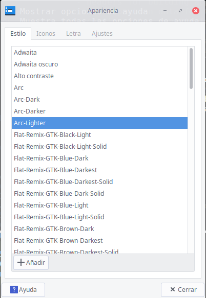
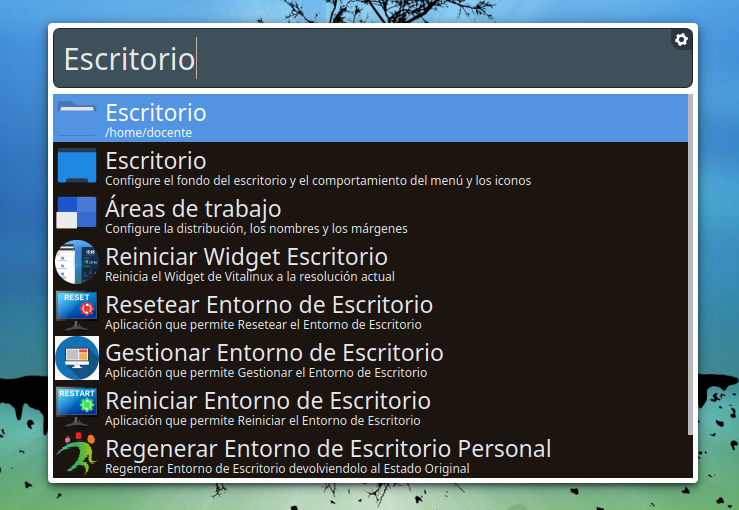
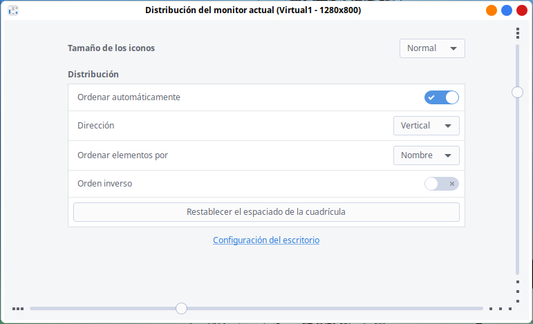
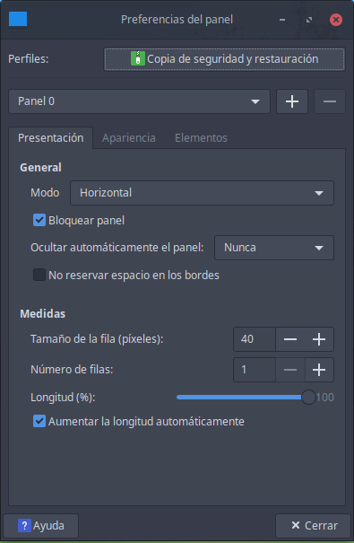

# Personalización de Vitalinux 2.x

## Contenido

Como ya se ha señalado en apartados anteriores, la forma de personalizar el entorno de Escritorio de tu Vitalinux depende de la versión de Vitalinux que estés usando.  A continuación se mostrará como personalizar la versión 3.x:

- [1 Apariencia de Vitalinux 3.x](#PersonalizarApariencia)
- [1 Personalización del Escritorio Vitalinux 3.x](#PersonalizacionEscritorioVitalinux)
- [2 Personalización del Panel Superior](#PersonalizarPanelSuperior)


Antes de empezar a personalizar tu Vitalinux 3 debes tener en cuenta que ciertas opciones de personalización están restringidas. Es decir, al tratarse de un sistema operativo pensado para ser usado esencialmente en centros educativos, algunas de sus opciones de configuración no estan operativas con la finalidad de evitar usos malintencionados o indebidos.


## Apariencia de Vitalinux 3.x {#PersonalizarApariencia}

Un aspecto que nos puede interesar a la hora de personalizar nuestro Entorno en <tt>Vitalinux</tt> es la <b>Apariencia y Comportamiento de las Ventanas</b>.  En concreto, podemos personalizar el <b>tema de la apariencia</b> de las ventanas, sus <b>bordes</b> o el <b>tema de iconos</b>. Para configurar todo lo anterior deberemos teclear <b>CONTROL+ESPACIO</b> y escribir <b>apariencia</b> (*personalice la apariencia del escritorio*).


Configuración de la apariencia en Vitalinux 3


## Personalización del Escritorio Vitalinux 2.x {#PersonalizacionEscritorioVitalinux}

Para poder personalizar el fondo de pantalla y la distribución de los accesos directos en el Escritorio necesitaremos:

1. Pinchar con el botón derecho del ratón sobre el **Escritorio** y elegir la opción ***Configurar***.  Desde el diálogo de configuración su puede decidir la distribución de los accesos directos o lanzadores del Escritorio y otros aspectos visuales.
2. Para modificar y configurar la imagen de fondo del Escritorio pulsa **CONTROL+ESPACIO** y escribe ***Escritorio*** (*advierte que el comentario informativo de esta opción indica configurar el fondo de escritorio*) y confirma pulsando a la tecla **Intro**.

## Personalización del Panel Superior del Escritorio {#PersonalizarPanelSuperior}

Otra opción de personalización del **Entorno de Escritorio** de <tt>Vitalinux</tt> es editar el **panel superior**.  Para editar el panel inferior será necesario pinchar con el botón derecho del ratón sobre el panel (*sobre el área del panel que este libre*) y elegir ***Panel/Preferencias del panel***. Entre las diferentes opciones de configuración del panel que encontrarás, destacaríamos la posibilidad de elegir <b>la posición del panel</b>, <b>su tamaño</b>, <b>su apariencia</b>, etc.

