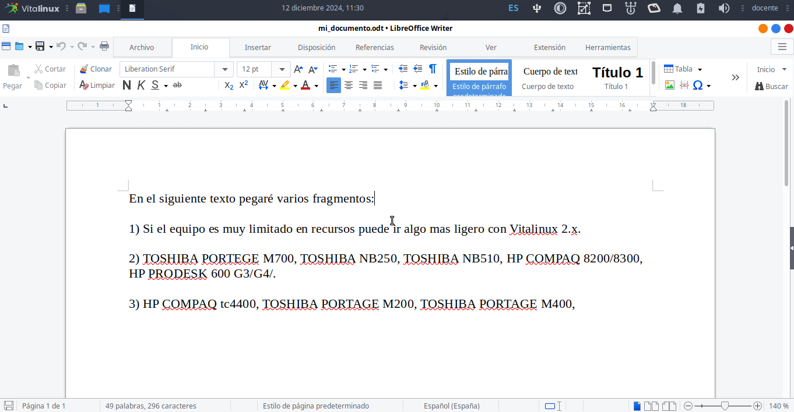
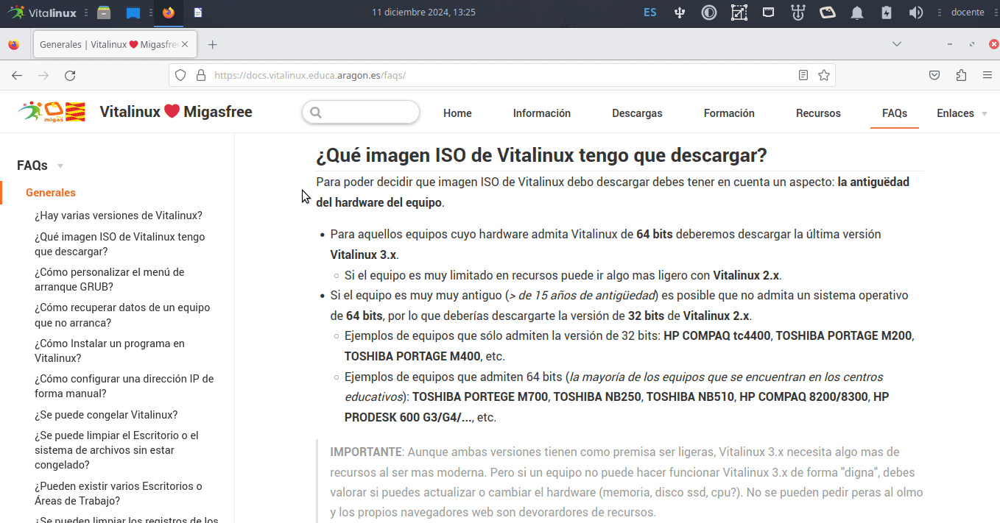
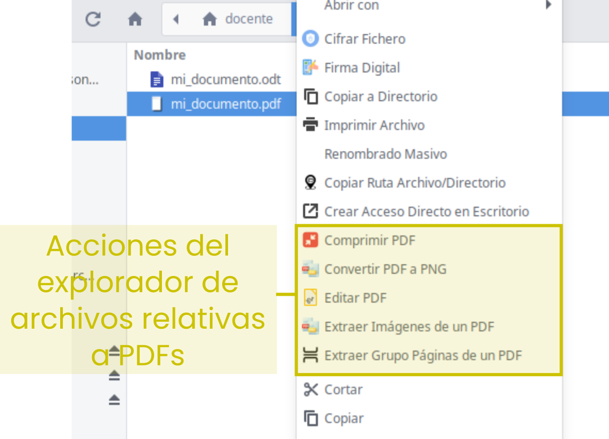
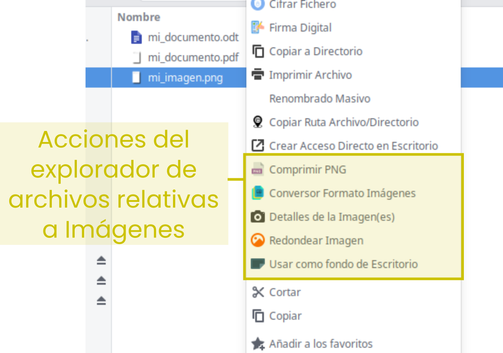
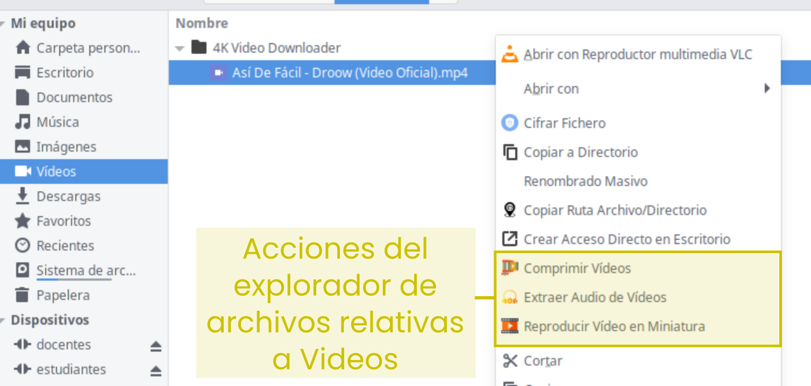

{% notificacion_task title='Utilidades de Vitalinux',
numexer='6.1',
req='Es necesario haber leído todo lo referente utilidades y <a href="./Parte_6-Acciones_del_explorador_de_archivos.md">Acciones del Explorador de Archivos de Vitalinux</a>',
formatoentrega='En un documento ofimático escribe y pega las fotos o capturas de pantalla necesarias para justificar todo lo que se te pide a continuación. Si es posible expórtalo a <b>formato PDF</b> para garantizar su portabilidad, y adjúntalo como respuesta a la tarea solicitada. Haz lo mismo con los GIF animados que hayas generado (puedes crear un archivo ZIP compriendo el conjunto de elementos a entregar). Por tanto, envía al tutor un único archivo <b>.zip</b> que se nombrará siguiendo las siguientes pautas: <b>apellido1_apellido2_nombre_TareaX.zip</b>.
 
Asegúrate que el nombre no contenga la letra ñ, tildes ni caracteres especiales extraños. Así por ejemplo la alumna <b>Begoña Sánchez Mañas</b>, debería nombrar esta tarea como: <b>sanchez_manas_begona_Tarea6.1.zip</b>' %}

Mediante la siguiente tarea nos familiarizaremos con algunas aplicaciones que están disponibles o pueden instalarse en Vitalinux y que seguramente te resultarán muy útiles en tu día a día: utilidades, acciones del explorador de archivos, etc.

<ol>

<li>
<b>Crear GIF animado</b>. Abre <b>Vitalinux Play</b> e instala la aplicación <b>Peek</b>. Esta aplicación nos permite crear un gif animado del área del entorno de Escritorio que encuadremos, resultando útil para explicar a nuestro alumnado determinados procedimientos informáticos. Para probarlo, una vez instalado, abre <b>Peek</b> tecleando <i>Control + Espacio</i> y escribiendo <i>Peek</i>. Verás que se abrirá un marco de encuadre que ajustarás al área que quieres grabar. A modo de ejemplo, graba y genera un GIF animado mostrando como poner en negrita o cursiva un texto en la herramienta ofimática Libreoffice Writer (<i>el GIF animado adjunto muestra todo el proceso</i>), aunque puedes hacerlo de cualquier otro procedimiento. El GIF animado resultante lo deberás adjuntar a la tarea (<i>genera un ZIP con todos los elementos a entregar</i>).
 <i>Nota: Para comprobar la correcta creación del GIF animado puedes abrir el GIF resultante con el programa <b>Ristretto</b> o con alguno de los navegadore Web, los cuales vienen preinstalados en Vitalinux. Para abrirlo con <b>Ristretto</b>, desde el Explorador de Archivos, pincha con el botón derecho del ratón sobre el archivo GIF y selecciona la opción <b>Abrir con</b> y en su desplegable seleccionar Ristretto o algún navegador web como Firefox.</i>
  

<i>Img:</i> <tt>Cómo usar Peek para crear un GIF animado de un procedimiento informático</tt>

 
</li>

<li>
<b>Gestión del historial del portapapeles</b>. Un aspecto que puede resultar muy útil y hacer más eficiente en su uso al equipo y la gestión adecuada del historial del portapapeles. El portapapeles es el lugar de nuestro equipo donde se van almacenando todas las cosas que vamos copiando. En ocasiones nos puede interesar recuperar del portapapeles elementos que copiamos con anterioridad para usarlos en documentos que estamos editando y no sabemos como hacerlo. Aunque hay diferentes formas de hacerlo, aquí haremos uso de nuestro lanzador de aplicaciones <b>Albert</b>, nuestro querido <b>Control + Espacio</b>. En el siguiente GIF animado hecho con Peek se muestra como configurar Albert para hacer uso del portapapeles o clipboard, para posteriormente copiar varios trozos de textos (<i>atajo de teclado <b>control+c</b></i>) y pegarlos en un documento que estamos editando (<i>atajo de teclado <b>control+v</b></i>). Haz tu lo mismo y comprueba su utilidad. Genera tu propio GIF animado explicando como hacer uso de esta utilidad y agrégalo a la tarea (<i>genera un ZIP con todos los elementos a entregar</i>).
 <i>Nota: En el siguiente GIF se muestra como configurar Albert para que gestione el portapapeles. Para configurar Albert puede pinchar en su esquina superior derecha o teclear control+espacio y escribir <b>Settings</b> (Albert settings). Desde la venta de configuración de Albert deberemos activar el plugin <b>Clipboard</b> en <b>Plugins</b> y posteriormente definir un prefijo en <b>Query</b> (p.e. "cb") de tal forma que al escribirlo en Albert éste sepa que quieres hacer uso del historial del portapapeles.</i>

  

<i>Img:</i> <tt>Reproducir Vídeo en miniatura</tt>

 
</li>

<li>
<b>Cifrar ficheros</b>. Comprueba que si pinchas con el botón derecho del ratón sobre un archivo mostrado por el <b>Explorador de Archivos</b> se te ofrecerá la posibilidad de <b>"Cifrar Archivo"</b>. Este cifrado generará un nuevo archivo cifrado (<i>*.aes</i>) a partir del original basado en un clave que se te solicitará (<i>deberás introducir la clave dos veces como confirmación</i>). Esa misma clave será la que tendrá que introducir el usuario destinatario para poderlo descifrar.  Para comprobar su funcionamiento, escoge un archivo PDF, imagen o documento ofímatico que tengas a mano y cífralo introduciendola la clave que tu desees. Después cópialo a otro directorio diferente y comprueba que al pinchar con el botón derecho del ratón sobre el archivo cifrado (<i>*.aes</i>) el <b>Explorador de Archivos</b> te ofrecerá la opción de <b>"Descifrar Fichero"</b>.
</li>

<li>
<b>Descargar vídeos de youtube</b>. Para la siguiente utilidad será necesario instalar el programa <b>4k Video Downloader</b> haciendo uso de <b>Vitalinux Play</b> o <b>synaptic</b>. Una vez instalado, lanza el programa tecleando <b>control+espacio</b> y escribiendo <b>4k Video Downloader</b> (<i>Si el programa te indica que debes descargar una actualización no lo hagas, de ello nos encargamos los técnicos de Vitalinux a través de Migasfree</i>). A continuación buscaremos un video en youtube a descargar, para lo cual haremos uso de la potencia de Albert. Teclea <b>control+espacio</b> y escribe la palabra <yt> seguido del patrón de busqueda que quieres hacer en youtube. Por ejemplo, si queremos buscar un vídeo en youtube de como usar el programa <b>openshot</b> en Vitalinux escribiremos en el Albert <b>yt vitalinux openshot</b>, lo cual abrirá tu navegador web favorito con la búsqueda indicada en youtube. Selecciona el vídeo en concreto que quieres descargar y copia la URL del navegador. Después copia esta en <b>4k Video Downloader</b> y verás que podrás descargar el vídeo o su audio en diferentes calidades.
</li>

 

<i>Img:</i> <tt>Cómo descargar vídeos de youtube con 4k Video Downloader</tt>

 

<li>
<b>Acciones del Explorador de Archivos</b>: <b><tt>Vitalinux</tt></b> hace uso del Explorador de Archivos <b>Pcmanfm</b> en Vitalinux 2, y <b>Nemo</b> en Vitalinux 3, los cuales se caracterizan por ser muy ligeros, pero al mismo tiempo, muy potentes. Mediante el uso de las <b>Acciones</b> vamos a poder realizar tareas simples desde el propio <b>Explorador de Archivos</b> sin necesidad de depender de una aplicación externa:   Con la finalidad de apreciar la gran versatilidad y funcionalidad del explorador de archivos a continuación se propone comprobar las siguientes <b>acciones</b> (<i>en el vídeo que se adjunta, se explican y completan cada una de ellas en el mismo orden que se solicitan</i>).
</li>
<ul>
<li>Abre el <b>Explorador de Archivos</b> (<i>Tecla Windows + E</i>)</li>

<li><b>Utilidades PDFs</b>: Desde el explorador de archivos podrás realizar de una manera muy eficiente la compresión de archivos PDF, la unión de varios de ellos o la extracción de un conjunto de páginas.  Prueba alguna de ellas.
</li>

 

<i>Img:</i> <tt>Acciones del Explorador de Archivos sobre documentos PDF</tt>

 

<ul>

<li><b>Comprimir PDFs</b>.  Almacena <b>archivos PDFs</b> en algún directorio de tú perfil en <tt>Vitalinux</tt>,  y desde el <b>Explorador de Archivos</b> selecciona uno o varios de ellos (<i>pinchando con el botón izquierdo del ratón y manteniendo la tecla CONTROL pulsada</i>), después pincha con el botón derecho del ratón sobre los documentos seleccionados, y selecciona dentro de <b>"Utilidades PDFs"</b> la opción <b>"Comprimir PDF"</b>.  Comprueba que se crean archivos resultantes junto a los seleccionados con el mismo nombre pero un sufijo <b>-comp</b> (<i>comprimido</i>).  Advierte si el tamaño se ha reducido considerablemente, conservando al mismo tiempo que sean legibles (<i>si no dispones de un PDF de gran tamaño para comprobar la compresión, puedes <a href="https://www.dropbox.com/s/ll2h99xneo6oqkf/libro_seguridad_informatica.v14.5.pdf?dl=0">descargarte este</a></i>).</li>

<li><b>Unir PDFs</b>.  Almacena <b>archivos PDFs</b> en algún directorio de tú perfil en <tt>Vitalinux</tt>, y desde el <b>Explorador de Archivos</b> selecciona simultáneamente varios de ellos pinchando con el botón izquierdo del ratón y manteniendo la tecla CONTROL pulsada, pincha con el botón derecho del ratón sobre los documentos seleccionados, y selecciona dentro de <b>"Utilidades PDFs"</b> la opción <b>"Unir PDFs"</b>.  Comprueba que se crea un archivo resultante junto a los seleccionados con el nombre de <b>resultado-union-pdfs.pdf</b> (<i>puedes renombrar el archivo seleccionando el archivo y pulsando la tecla <b>F2</b></i>)</li>

<li><b>Extraer Grupo de Páginas de un PDF</b>.  Desde el <b>Explorador de Archivos</b> pincha con el botón derecho del ratón sobre algún <b>documento PDF</b>, y selecciona dentro de <b>"Utilidades PDFs"</b> la opción <b>"Extraer Grupo Páginas ..."</b>.  Comprueba que se crea un archivo resultante junto al documento original seleccionado con el mismo nombre pero con un sufijo que indica las páginas extraídas.</li>

<li>
Como alternativa a las acciones anteriores del Explorador de Archivos puedes hacer uso de la aplicación <b>pdfarranger</b>. Busca e instala la aplicación <b>pdfarranger</b> en tu <b>Vitalinux Play</b> y comprueba que nos permite hacer cosas similares a las anteriores: eliminar páginas del PDF, alterar el orden de las páginas, etc.
</li>

</ul>

<li><b>Utilidades de Imágenes</b>: Desde el Explorador de Archivos podrás llevar a cabo ciertas acciones sobre tus imágenes, tales como generar una imagen en miniatura, comprimir la imagen (<i>*.jpg/*.png</i>), cambiar el formato de la imagen (<i>jpg->png, jpg->bmp, png->pdf...</i>), etc. Prueba alguna de ellas:

 

<i>Img:</i> <tt>Acciones del Explorador de Archivos sobre imágenes</tt>

 

</li>

<ul>

<li><b>Comprimir JPG/PNG</b>.  Almacena <b>Imágenes JPG o PNG</b> en algún directorio de tú perfil en <tt>Vitalinux</tt>, y desde el <b>Explorador de Archivos</b> pincha con el botón derecho del ratón sobre varios de ellos simultáneamente, y selecciona dentro de <b>"Utilidades Imágenes"</b> la opción <b>"Comprimir ..."</b>.  Comprueba que se crean archivos resultantes con la extensión del nombre "-comp".  Advierte si el tamaño se ha reducido considerablemente, conservando al mismo tiempo su resolución</li>

<li><b>Información Detallada de Imágenes</b>.  Almacena <b>Imágenes</b> en algún directorio de tú perfil en <tt>Vitalinux</tt>, y desde el <b>Explorador de Archivos</b> pincha con el botón derecho del ratón sobre varios de ellos simultáneamente, y selecciona dentro de <b>"Utilidades Imágenes"</b> la opción <b>"Detalles de la Imagen"</b>.  Advierte la información detallada de salida</li>

<li><b>Cambiar formato de Imágenes</b>.  Almacena <b>Imágenes</b> en algún directorio de tú perfil en <tt>Vitalinux</tt>, y desde el <b>Explorador de Archivos</b> pincha con el botón derecho del ratón sobre varios de ellos simultáneamente, y selecciona dentro de <b>"Utilidades Imágenes"</b> la opción <b>"Conversor Formato Imágenes"</b> (<i>por ejemplo, cambia varias imágenes a formato BMP o PDF</i>).  Comprueba que se crean archivos resultantes junto a los seleccionados pero con el formato y extensión especificados</li>

</ul>

<li><b>Comprimir MP3</b>.  Almacena <b>archivos MP3</b> en algún directorio de tú perfil en <tt>Vitalinux</tt>, y desde el <b>Explorador de Archivos</b> selecciona varios de ellos (<i>pincha con el botón izquierdo del ratón sobre ellos manteniendo la tecla CONTROL pulsada</i>), y estando seleccionados, pincha con el botón derecho del ratón sobre ellos y selecciona dentro de <b>"Utilidades Música"</b> la opción <b>"Comprimir MP3"</b>.  Comprueba que se crea una subcarpeta con los archivos comprimidos (<i>p.e. 64Kbps</i>), y advierte que se ha reducido su tamaño, pero que al mismo tiempo se escuchan bien.
 </li>

<li><b>Utilidades de Videos</b>: Desde el Explorador de Archivos podrás llevar a cabo ciertas acciones sobre tus videos, tales como comprimirlos, reproducir en miniatura o extraer su audio. Prueba alguna de ellas:

 

<i>Img:</i> <tt>Acciones del Explorador de Archivos sobre videos</tt>

 

</li>

<ul>
    <li><b>Reproducir Vídeo en Miniatura</b>.  Haciendo uso de la aplicación anteriormente comentada, <b>4k Video Downloader</b>, almacena un <b>archivo de vídeo</b> en algún directorio de tú perfil de usuario, y desde el <b>Explorador de Archivos</b> pincha con el botón derecho del ratón sobre él, y selecciona la opción <b>"Reproducir Vídeo en Miniatura"</b>.  Comprueba que el vídeo se reproduce en una de las esquinas de tu Entorno de Escritorio pudiendo trabajar simultáneamente con el equipo con otras aplicaciones.  Por ejemplo, abre <b>Libreoffice Writer</b> y redacta algo mientras se visualiza el vídeo en miniatura.  Para cerrar el vídeo debes pinchar sobre él con el ratón y pulsar la tecla <b>q</b> (<i>quit</i>).
    </li>
    <li><b>Comprimir Vídeo</b>.  Esta acción del explorador de archivos te permitirá comprimir vídeos, pero ten en cuenta que si el vídeo ya esta comprimido, por ejemplo por propio youtube, es posible que la compresión no sea efectiva.
    </li>
    <li><b>Extraer audio del vídeo</b>.  Esta acción del explorador de archivos te permitirá extraer el audio del vídeo que selecciones.
    </li>
</ul>

</ul>

<li>
<b>Aplicaciones Flash/SWF</b>: En este apartado nos gustaría destacar que <b>desde Vitalinux seguimos dando soporte a aplicaciones Flash/SWF</b>.  Es decir, a finales del año 2020 las principales compañías de software (<i>Microsoft, Google, Firefox, etc.</i>) decretaron el fin del soporte/reproducción de sitios Webs con contenidos Flash por posibles problemas de seguridad, debiendo rehacerse éstas en formato HTML5 por parte de los creadores.  Tras advertir que muchos centros educativos de infantil y primaria eran dependientes de este tipo de formatos Flash/SWF, desde Vitalinux se hizo un esfuerzo para seguir reproduciéndolos.  Para comprobarlo, te sugerimos lo siguiente:
<ol>
    <li>
    Descarga el siguiente archivo comprimido en Vitalinux, <a href="https://migasfree.educa.aragon.es/cosas-centros/curso-aularagon/juegos-flash-swf.zip">Juegos Flash</a>, descomprímelo y prueba a ejecutar mediante un doble click alguno de los archivos Flash que contiene.
     <i>Nota:Una vez descargado el archivo ZIP lo podrás descomprimir pinchando con el botón derecho del ratón sobre el fichero ZIP y seleccionado la opción de descomprimir. Así obtendrás los archivos SWF que podrás abrir haciendo doble click sobre ellos.</i>
    </li>
    <li>
    Teclea <b>CONTROL + ESPACIO</b> y escribe <b>Abrir Web o Fichero con contenidos Flash</b>.  En el asistente que te aparecerá selecciona la opción <b>URL sitio Web con Flash</b>, y escribe como URL alguna página tradicional de recursos educativos que siga teniendo sus contenidos en Flash (<i>p.e. http://www.ceiploreto.es, es una web por defecto</i>).
    </li>
</ol>
</li>

<li>Por último, indica alguna funcionalidad que te gustaría que estuviera incluida dentro del Explorador de Archivos o a nivel de sistema, y que actualmente no esta implementada.  <b>¡¡Esto nos puede servir a los que desarrollamos <tt>Vitalinux</tt> para mejorarlo!!</b>
</li>

</ol>



