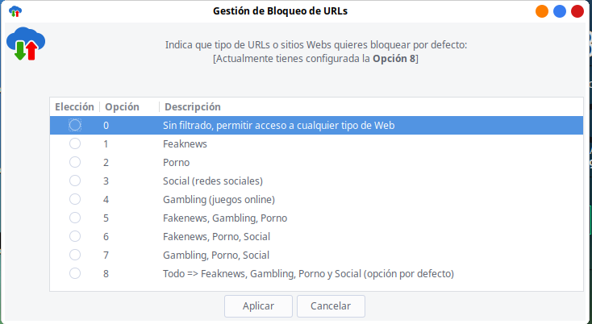

{% notificacion_task title='Servicios de Congelación, bloqueo de URLs y Navegación en Modo Incógnito',
numexer='6.3',
req='Es necesario haber leído todo lo referente a <a href="../Parte_6-Aplicaciones_utiles_y_alternativas/Parte_6-Recursos_centros_educativos.md">Recursos para Centros Educativos</a>',
formatoentrega='En un documento ofimático escribe y pega las fotos o capturas de pantalla necesarias para justificar todo lo que se te pide a lo largo de la tarea. Si es posible expórtalo a <b>formato PDF</b> para garantizar su portabilidad, y adjúntalo como respuesta a la tarea solicitada. Por tanto, envía al tutor un único archivo <b>.pdf</b> que se nombrará siguiendo las siguientes pautas: <b>apellido1_apellido2_nombre_TareaX.pdf</b>.
 
Asegúrate que el nombre no contenga la letra ñ, tildes ni caracteres especiales extraños. Así por ejemplo la alumna <b>Begoña Sánchez Mañas</b>, debería nombrar esta tarea como: <b>sanchez_manas_begona_Tarea6.3.pdf</b>' %}

En la presente tarea se van a mostrar algunos de los servicios que pueden configurarse a los equipos de los centros educativos de manera <b>personalizada</b>, <b>masiva</b> (<i>a todos aquellos equipos que se desee</i>), <b>remota</b> (<i>lo impondrá el servidor Migasfree</i>) y <b>desatendida</b> (<i>nadie del centro se tendrá que preocupar por ello, lo hará todo Migasfree</i>).  Asumiendo que el equipo <tt>Vitalinux</tt> con el que estás haciendo el curso se encuentra fuera de un centro educativo, no será posible probar servicios como <b>Carpetas Compartidas</b> o <b>el Control de Equipos de Aula</b>, pero si será posible probar otros que pueden resultar de interés como <b>los Sistemas de Congelación</b> (<i>es conveniente haber leido la teoría para entender que la congelación en Vitalinux difiere de la usada en los sistemas Windows, al entender que ésta última no tiene ningún sentido</i>) o <b>la Navegación en Modo Incognito o Privada</b>.
  

<pre style="border: 1; border-color: brown; background-color: orange; text-align: center;white-space: pre-wrap; color: white; font-weight: bold; font-size: 110%;">
¡ATENCIÓN! La congelación no es una congelación al estilo Windows. No se congelan los programas, sólo se congelan los datos, las configuraciones o personalizaciones. La congelación no esta pensada para mantener una configuración creada por un usuario, sino al revés, esta pensada pare revertir configuraciones hechas previamente por el usuario (<i>las configuraciones y personalizaciones se deciden a nivel de centro educativo</i>).  Por ello, como consecuencia de la congelación se eliminarán las personalizaciones del entorno de Escritorio que haya hecho el usuario, además de los archivos y directorios que se hayan guardado en el Escritorio y otros directorios del perfil del usuario, que no hayan sido definidos previamente en los patrones de congelación. Por todo lo anterior, <b>antes de proceder a la congelación asegurate de guardar la información y archivos personales que tengas en el equipo Vitalinux, guardándolos en una memoria USB o similar</b>.
</pre>

<ul>
<li>
<b>CONGELACIÓN únicamente del Escritorio</b>
</li>
<ol>

<li>
Para entender el funcionamiento de la congelación del Escritorio es fundamental comprender las diferencias entre <b>reiniciar, resetear y regenerar el Entorno de Escritorio</b>.
<ol type="A">
<li>
<b>Reiniciar Entorno de Escritorio</b>.  Utilidad que permite reiniciar y actualizar el Entorno de Escritorio.  Puede resultar útil cuando queremos actualizarlo ante algún cambio de configuración, o cuando el Entorno de Escritorio o Explorador de Archivos se quedan colgados.  Esta acción reinicia todos los elementos que componen el Entorno de Escritorio y cierra el Explorador de Archivos en el caso de que esté iniciado.  Teclea <b>CONTROL+ESPACIO</b>, escribe <b>Reiniciar Entorno de Escritorio</b> y comprueba el efecto indicado.
</li>
<li>
<b>Resetear Entorno de Escritorio</b>.  Utilidad que permite reiniciar y eliminar cualquier configuración adicional que se haya realizado al Entorno de Escritorio.  Es decir, es similar a la acción anterior de reiniciar a la cual se le suma la purga de cualquier configuración personal que se haya hecho (por ejemplo añadir un panel, cambiar el tema de iconos...).  Puede resultar útil cuando queremos regresear al Entorno de Escritorio que viene de serie tras probar a modificar su aspecto o apariencia.  Es importnate señalar que esta utilidad no elimina ficheros o directorios creados por el usuario dentro del Escritorio.  Para comprobar su efecto, modifica la apariencia del Entorno de Escritorio y posteriormente teclea <b>CONTROL+ESPACIO</b>, escribe <b>Resetear Entorno de Escritorio</b>.
</li>
<li>
<b>Regenerar Entorno de Escritorio</b>.  Utilidad que permite resetear el Entorno de Escritorio y además eliminar cualquier tipo de archivo o directorio que el usuario haya almacenado en el Escritorio.  De esta forma, esta utilidad devuelve el Entorno de Escritorio al estado inicial tras la instalación de Vitalinux.  Esta es la acción que se desencadena en los equipos Vitalinux al apagarse cuando un centro o un usuario decide congelar el Escritorio.  Para comprobar su efecto, modifica la apariencia del Entorno de Escritorio, crea algún archivo/directorio en el Escritorio y posteriormente teclea <b>CONTROL+ESPACIO</b>, escribe <b>Regenerar Entorno de Escritorio</b>.
</li>
</ol>
</li>

<li>
La regeneración del escritorio se basa en la comparación con un directorio patrón, de tal forma que se elimina todo lo que difiere respecto al directorio patrón.  Por ello, para entender como añadir elementos al patrón de Escritorio congelado modificaremos dicho patrón.  Para conseguirlo deberemos abrir el <b>Explorador de Archivos</b> (<i>Tecla Windows + E</i>), y <b>Abrir como Root</b> el directorio <b>/etc/skel/Escritorio</b> en Vitalinux 2, o <b>/usr/share/vitalinux/skel/Escritorio</b> en Vitalinux 3.  Una vez dentro de ese directorio crea algún directorio y comprueba que al cerrar sesión o reiniciar el equipo el <b>Escritorio Congelado</b> impondrá el cambio realizado.
</li>

</ol>

<b>Nota</b>: Si quisieŕamos que éste efecto "limpieza" (congelación) se produzca cada vez que reiniciemos el equipo de forma automática, deberemos aplicar la Etiqueta migasfree <b>"SRV-CONGELARESCRITORIO"</b> y solucionado. En muchos centros educativos dicho comportamiento viene por defecto sin necesidad de etiqueta porque así lo han decidido.

<li>    
<b>CONGELACIÓN Total del perfil del usuario</b>: Etiqueta migasfree <b>"SRV-CONGELADORTOTAL"</b>
</li>
<ol>
<li>
La congelación total se puede probar de forma muy sencilla. Pero antes de hacerlo, recuerda que como no hay patrón definido, se borrará todo lo que haya en Documentos, Descargas, Imágenes, Vídeos...(los directorios principales) y el Escritorio. Así pues, haz una copia! Despues, teclea <b>CONTROL+ESPACIO</b> y escribe <b>Regenerar Perfil del Usuario</b>. Detectarás que se borrado lo que hubiera en dichos directorios principales (si no había nada, crea algún documento o carpeta y vuelve a ejecturarlo)
</li>
<li>
Comprueba que la congelación sólo actúa en los principales directorios del usuario: <b>Escritorio, Descargas, Documentos, Imágenes, Música, Plantillas, Público y Vídeos</b>.  Es decir, crea un directorio dentro de la raíz de tu perfil llamado <b>Curso</b> (<i>p.e. /home/docenmte/Curso, /home/estudiante/Curso, /home/aularagon/Curso, /home/administrador/Curso, etc.</i>).  Copia dentro de ese directorio algún archivo (<i>imágenes, documentos ofimáticos, etc.</i>) y comprueba que ese directorio y su contenido prevalece ante la congelación.
</li>
<li>
La congelación se basa en la comparación con un directorio patrón, de tal forma que se elimina todo lo que difiere respecto al directorio patrón.  Por ello, y para entender como añadir elementos a los directorios congelados, modificaremos los directorios patrón.  Para conseguirlo deberemos abrir el <b>Explorador de Archivos</b> (<i>Tecla Windows + E</i>), y <b>Abrir como Root</b> el directorio <b>/etc/skel-directorios</b> en Vitalinux 2, o <b>/usr/share/vitalinux/skel/</b> en Vitalinux 3.  Dentro de ese directorio localizaremos tantos directorios como directorios están congelados en el perfil del usuario.  Modifica el contenido de cualquiera de ellos y comprueba su efecto.
</li>
</ol>

<b>Nota</b>: Si quisieŕamos que éste efecto "limpieza" (congelación) se produzca cada vez que reiniciemos el equipo de forma automática, deberemos aplicar la Etiqueta migasfree <b>"SRV-CONGELADORTOTAL"</b> y solucionado. En muchos centros educativos dicho comportamiento viene por defecto sin necesidad de etiqueta porque así lo han decidido.

    

<pre style="border: 1; border-color: brown; background-color: orange; text-align: center;white-space: pre-wrap; color: white; font-weight: bold; font-size: 110%;">¡Recuerda que la "Congelación al estilo Vitalinux" sólo afecta a los datos del usuario, nunca a los programas o aplicaciones que haya instaladas! - Podemos instalar/desinstalar/actualizar los programas y aplicaciones en Vitalinux independientemente de que esté congelado el equipo</pre>

<li>    
<b>Servicio de Bloqueo de URLs</b>: Etiqueta migasfree <b>"SRV-BLOQUEAR_URLS"</b>. Este servicio nos permitirá tener un control de los sitios Web que pueden ser navegables en función de su temática: pornografía, fakenews, redes sociales o gambling.
</li>
    <ol>
    <li>
    Añade la etiqueta Migasfree <b>"SRV-BLOQUEAR_URLS"</b> y comprueba, una vez el equipo que está actualizado contra Migasfree, que no se puede navegar en ninguna Web de pornografía, fakenews, redes sociales o gambling. Prueba a acceder a Webs como Facebook, Instagram o Pornohub, y comprueba que no es posible. Los listados de las Webs afectadas por este bloqueo se publican <a href="https://github.com/StevenBlack/hosts" target="_blank">aquí</a>.
    </li>
    <li>
    A continuación veremos como configurar la herramienta de bloqueo de URLs para que sólamente bloquee la temática que nos interese. Teclea <b>control+espacio</b> y escribe <b>Bloquear URLs de Webs</b>. Tras autenticarte con una cuenta de perfil administrador, te aparecerá una ventana donde te dará a elegir entre 8 posibles opciones, en función de la temática de las Web a bloquear (<i>la opción por defecto es la 8</i>): 
    0) Sin Filtrado. Se permite el acceso a cualquier tipo de Web
    1) Feaknews 
    2) Porno 
    3) Social (redes sociales) 
    4) Gambling (juegos online) 
    5) Fakenews, Gambling, Porno 
    6) Fakenews, Porno, Social 
    7) Gambling, Porno, Social 
    8) Todo => Feaknews, Gambling, Porno y Social (opción por defecto) 
    Comprueba, a modo de ejemplo, que al elegir la <b>opción 5</b> ya puedes navegar en Webs de redes sociales (p.e. Facebook), pero siguen bloqueadas el resto de temáticas.
    </li>
     

<i>Img:</i> <tt>Opciones de Bloqueo de URLs por diferentes temáticas</tt>

 
    </ol>

<pre style="border: 1; border-color: brown; background-color: orange; text-align: center;white-space: pre-wrap; color: white; font-weight: bold; font-size: 110%;">Cuando los centros educativos solicitan este servicio de bloqueo de URLs, para los equipos de su centro, nos indican su opción preferida y se lo configuramos en los equipos que ellos decidan de forma automatizada. Algunos centros elaboran su propio listado de URLs personalizado para añadirlo a las URLs que ya vienen bloqueadas por defecto.</pre>

<li>    
<b>Navegación Web en Modo Incógnito o Privado</b>: Etiqueta migasfree <b>"SRV-NAVEGADORINCOGNITO"</b>
</li>
    <ol>
    <li>
    Como ya se ha comentado a lo largo de la teoría, los equipos de los centros docentes suelen ser utilizados dentro de la misma sesión por diferentes usuarios.  Con la finalidad de garantizar una determinada intimidad en relación a los sitios Web que se visitan, claves de autenticación que son usados, etc. a continuación veremos como imponer la <b>Navegación Web en Modo Incógnito o Privado</b>.
    </li>
    <li>
    Para poder imponer ese modo de navegación es necesario asignar una nueva etiqueta a nuestro equipo Vitalinux.  Por ese motivo deberemos modificar las etiquetas que tenga asignadas actualmente el equipo:  <b>CONTROL+ESPACIO</b> y teclear <b>Modificación de Etiquetas</b>.  Una vez abierto el diálogo de asignación deberemos marcar la etiqueta <b>"SRV-NAVEGADORINCOGNITO"</b>.
    </li>
    <li>
    Para comprobar su efecto simplemente deberemos abrir un navegador (<i>p.e. Google Chrome o Mozilla Firefox</i>) y hacer una búsqueda que no hayamos realizado antes.  Por ejemplo, <a href="http://soporte.vitalinux.educa.aragon.es">soporte.vitalinux.educa.aragon.es</a> (<i>conviene escribirla a mano, no copiar y pegar, para advertir que no esta cacheada, que no la reconoce como una Web visitada ya en el pasado</i>). Se puede comprobar el modo privado o incógnito ya que si cerramos el navegador usado y lo volvemos a abrir, deberemos volver a escribir completamente la URL sin que haya sido cacheada por el navegador.
    </li>
    <li>
    Por último, comprueba que si <b>desmarcas</b> la etiqueta <b>"SRV-NAVEGADORINCOGNITO"</b> volverás al modo de funcionamiento anterior.
    </li>
    </ol>

<li>    
<b>Resetear los Navegadores Web</b>: Firefox, Chromium o Google Chrome
</li>
    <ol>
    <li>
    En ocasiones nos puede interesar limpiar por completo los navegadores Web regresando al estado en que se encontraban tras su instalación. Esto eliminirá por completo todas las configuraciones realizadas por el usuario a lo largo de su uso: cookies, contraseñas, personalizaciones, publicidad, historial, favoritos, etc. A continuación veremos lo sencillo que es hacerlo.
    </li>
    <li>
    Con la finalidad de comprender las acciones que desencadenan el resetear los navegadores Web, abre el explorador de archivos, sitúate en el <b>HOME</b> o carpeta personal del usuario, y teclea el atajo <b>CONTROL+H</b> para ver los ficheros y direcorios ocultos (<i>su nombre comienza por un punto, "."</i>). Posteriormente lanza los navegadores Web firefox, chromium, ... que tengas instalados en tu equipo Vitalinux, y comprueba en el explorador de archivos que se habrán creado dentro del <b>HOME</b> los subdirectorios <b>.mozilla</b> (<i>para Firefox</i>), <b>.config/chromium</b> (<i>para Chromium</i>) o <b>.config/google-chrome</b> (<i>para Google Chrome</i>). Estos directorios se encargan de almacenar todas las personalizaciones y configuraciones de los navegadores Web. Si se eliminan estos directorios directorios se limpian por completo los navegadores web correspondientes.
    </li>
    <li>
    Teclea <b>CONTROL+ESPACIO</b> y escribe <b>Resetear navegadores Web</b>. Comprueba que esto elimina los directorios anteriores, y que al arrancar los navegadores estos lo hacen como si no lo hubieran hecho nunca.
    </li>
    </ol>
</ul>
