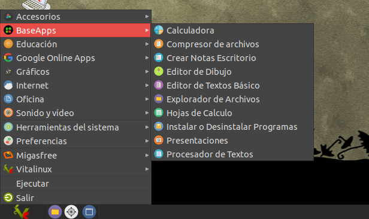
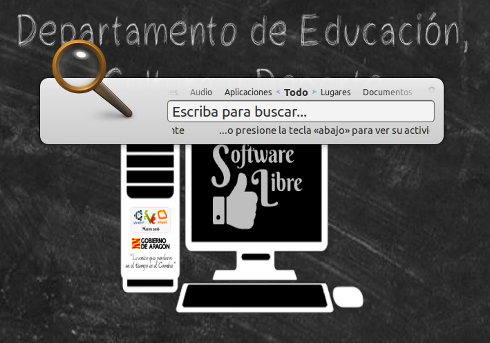
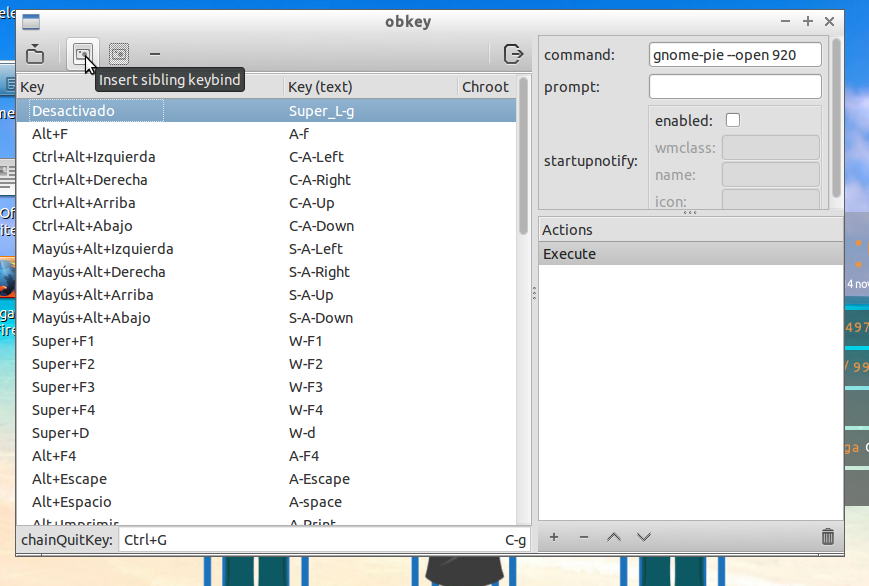
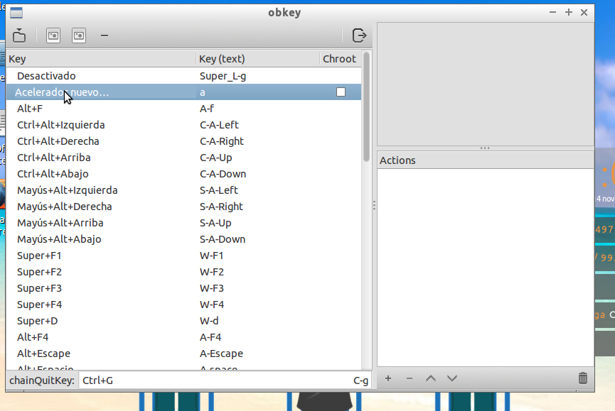
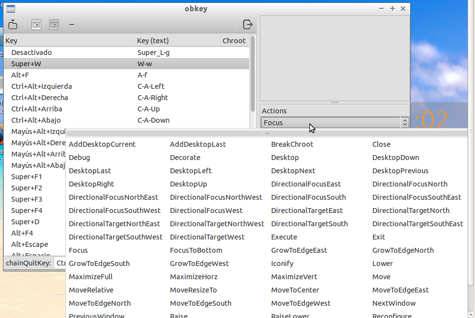
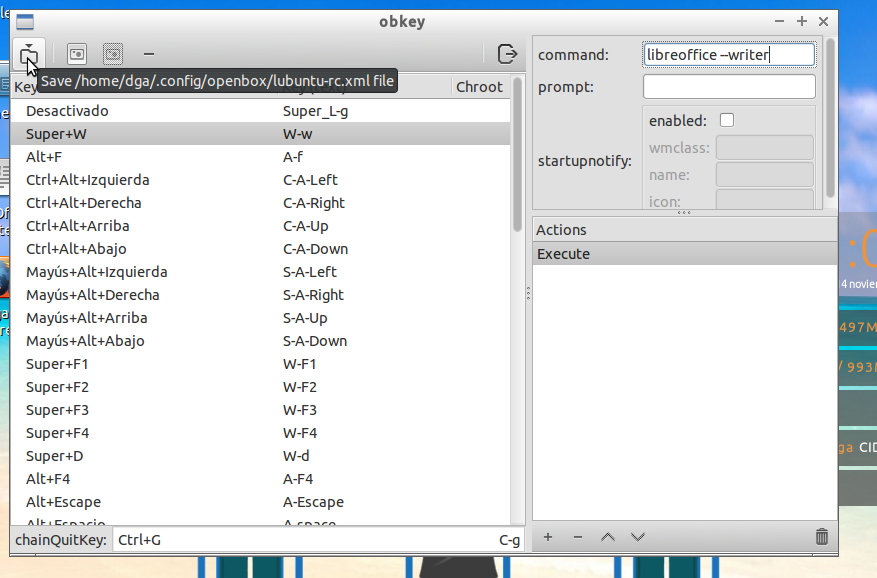

# ¿Cómo lanzar Aplicaciones?

## Contenido

- [1 Desde el clásico **Menú de Inicio**](#DesdeMenuInicio)
- [2 Mediante el **lanzador de Aplicaciones Synapse**](#DesdeLanzadorAplicacionesSynapse)
- [3 Lanzar Aplicaciones desde el **Dock de Aplicaciones Plank**](#DesdeDockAplicacionesPlank)
- [4 Lanzar Aplicaciones desde el **Dock Circular de Aplicaciones Gnome Pie**](#DesdeDockCircularAplicacionesGnomePie)
- [5 Mediante la configuración de **Atajos de teclado**](#MedianteAtajosDeTeclado)
    - [5.1 Atajos de Teclado predefinidos en Vitalinux (*Lubuntu*)](#AtajosTecladoPredefinidosVitalinux)
    - [5.2 Definir nuevos Atajos de Teclado](#DefinirAtajosTeclado)
- [6 Tarea 2.3: Repaso de estrategias para Lanzar y Matar Aplicaciones en Vitalinux](#LanzarMatarAplicaciones)

##  ¡¡Importante!! **¿Como lanzar aplicaciones en Vitalinux?**

En **Vitalinux** existen diferentes formas de abrir o lanzar aplicaciones.  Podríamos destacarse las siguientes: desde el **Menú Clásico de Inicio**, mediante el **Lanzador de Aplicaciones Synapse**, haciendo uso de los **Dock Plank o Gnome Pie** o mediante el uso de **Atajos de Teclado**.  ¡¡Todas ellas se describen a continuación!!

## Desde el clásico **Menú de Inicio** {#DesdeMenuInicio}

El **Menú de Inicio Clásico**  es el típico menú desplegable de Windows que puede desplegarse y acceder a sus aplicaciones pinchando con el botón izquierdo del ratón sobre el icono de **Vitalinux** que hay en la parte izquierda del panel inferior del Escritorio.  También puede desplegarse mediante el **Atajo de teclado** ***CONTROL+ESC***.

Una vez desplegado podrás comprobar que todos los lanzadores están clasificados por temática: **Internet, Oficina, Gráficos, Sonido y Video, etc.**

## Mediante el **lanzador de Aplicaciones Synapse** {#DesdeLanzadorAplicacionesSynapse}

Sin lugar a dudas, el uso del **Lanzador de Aplicaciones Synapse** es **la forma más aconsejable, rápida y eficiente** de lanzar aplicaciones</u>. Para lanzar cualquier aplicación del sistema tan sólo tendrás que pulsar la combinación de teclas **CONTROL+ESPACIO** y a continuación escribir un texto relacionado con la aplicación que deseas lanzar: por ejemplo, **firefox, chrome, matar proceso, etc...**.  Además si tecleamos una **palabra clave** que esta en varias aplicaciones, pulsando la **flecha que apunta hacia abajo** se desplegarán todas las aplicaciones o documentos que la contengan.  Por ejemplo, si escribimos **Libreoffice** y pulsamos la **flecha hacia abajo** veremos todas las aplicaciones de la suite ofimática Libreoffice, alternativa a las Microsoft Office.

Prueba a lanzar alguna aplicación para comprobar su eficiencia.

## Lanzar Aplicaciones desde el **Dock de Aplicaciones Plank** {#DesdeDockAplicacionesPlank}

En Vitalinux se puede habilitar un **Dock** o **barra de aplicaciones más comunes** a través de la cual se pueden lanzar aplicaciones preconfiguradas o añadir nuevas.  Para usarlo será necesario habilitar el **Dock** de la siguiente forma: teclear **CONTROL+ESPACIO** y teclear **habilitar o deshabilitar dock plank**, a continuación te pedirá la contraseña de administración (**careidga** es la password *por defecto, para los usuarios dga y profesor*), y desde allí ya podrás habilitarlo.

Habilita el Dock Plank, cierra sesión (***CONTROL+ESPACIO** y teclear **cerrar sesión***), e inicia sesión de nuevo y comprobarás que éste, una vez habilitado, se despliega de manera automática al acercar el ratón en la parte superior central del **Escritorio**.  Comprueba su correcto funcionamiento pinchando sobre alguno de sus lanzadores de aplicaciones.  El aspecto y comportamiento de este **Dock** puede personalizarse pinchando con el botón derecho del ratón sobre el **icono ancla** que hay en este **Dock**.  Además puedes añadir o anclar aplicaciones nuevas arrastrándolas desde el menú de inicio al **Dock**, o una vez estas estén abiertas.

## Lanzar Aplicaciones desde el **Dock Circular de Aplicaciones Gnome Pie** {#DesdeDockCircularAplicacionesGnomePie}

Al igual que el **Dock Plank** anterior, para trabajar con él es necesario habilitarlo: teclear **CONTROL+ESPACIO** y teclear **habilitar o deshabilitar gnome pie**, a continuación te pedirá la contraseña de administración (**careidga** es la password *por defecto, para los usuarios dga y profesor*), y desde allí ya podrás habilitarlo.

Para hacer uso de él es necesario teclear la combinación de teclas **Tecla Windows + G**.  Comprueba su correcto funcionamiento.

## Mediante la configuración de **Atajos de teclado** {#MedianteAtajosDeTeclado}

Sin lugar a dudas, el uso de combinación de teclas para el acceso a recursos y aplicaciones es la forma más rápida y eficiente de interactuar con un sistema operativo.  En **Vitalinux** es posible modificar los atajos existentes e introducir nuevos, pero recuerda que al estar trabajando en **modo Live**, todos los cambios que hagas no permanecerán en el siguiente reinicio.

Podemos repasar algunos de los **Atajos** que ya están predefinidos e incluso probar a definir alguno:

### Atajos de Teclado predefinidos en Vitalinux (*Lubuntu*) {#AtajosTecladoPredefinidosVitalinux}
1.  Tecla **IMPRIMIR PANTALLA**: Lanza un programa que nos permitirá capturar la pantalla completa, una ventana activa, o una parte de la pantalla.  Además nos permitirá elegir un nombre para la captura y su ubicación (*por defecto la dejará en la carpeta del HOME del usuario **Imágenes***)
1.  Tecla **F11**: Pone en pantalla completa la ventana que tengamos abierta
1.  Combinación **Tecla de Windows + E**: Abre el explorador de archivos de Vitalinux
1.  Combinación **Tecla de Windows + D**: Minimiza todas las ventanas y nos muestra únicamente el Escritorio limpio.  Para regresar a la situación en la que estabamos, podemos volver a pulsar dicha combinación.
1.  Combinación **CONTROL + ESC**: Despliega el menú de Inicio clásico de aplicaciones
1.  Combinación **CONTROL + ALT + T**: Abre una terminal de comandos
1.  Combinación **ALT + F4**: Cierra la ventana que este en ese momento activa
1.  Combinación **ALT + TABULADOR**: Permite navegar entre las distintas ventanas que tenemos abiertas.  Para probarlo, podemos abrir varias aplicaciones y comprobar su efecto.
1.  Combinación **ALT + SHIFT + TABULADOR**: Permite navegar entre las distintas ventanas que tenemos abiertas en sentido inverso al anterior.  Para probarlo, podemos abrir varias aplicaciones y comprobar su efecto.
1.  Combinación **Tecla Función + f7** y **Función + f8**: Subir/Bajarla intensidad de la luz del ordenador
1.  Combinación **Tecla Función + f11** y **Función + f12**: Subir/Bajar el volumen
1.  Combinación **CONTROL + ALT + SUPRIMIR**: Cierra la sesión del usuario

### Definir nuevos Atajos de Teclado {#DefinirAtajosTeclado}

Vamos a definir un nuevo atajo, de forma que cuando ejecute la tecla Windows y la letra w (sin soltar la tecla windows) me arranque el Libreoffice Writer...para ir a toooooooda velocidad. Para definir éste nuevo atajo de teclado, tenemos en Vitalinux una aplicación instalada llamada Obkey. 

1. Para lanzar la aplicación, nada más facil que teclear Ctrl-Espacio y escribir *atajos* y cuando veamos la aplicación **Configurar atajos con Obkey** pulsar Intro

2. Ahora podemos ver los atajos que hay definidos o crear uno nuevo. Para añadir uno, simplemente deberemos pulsar el botón *Insert sibling keybing* (el segundo empezando por la izda)

3. Cuando lo creemos se añadirá una nueva fila en la tabla de inferior, para que podamos definir nuestro atajo con el valor de Key A y el Key(text) A. Si clickamos sobre la A de la columna Key podemos hacer la combinación que deseemos (por ejemplo, la tecla Windows y la W)

4. Ahora, deberemos asociar una acción a dicha combinación. Seleccionada la combinación que he realizado, vamos a la caja de Actions de la derecha y clickamos en el botón de + para definir una nueva acción. Por defecto sale Focus, y lo cambiaremos a Execute

5. En la caja de texto que aparece arriba al lado de command, indicamos el comando que queremos asociar al atajo. En mi caso: `libreoffice --writer`. (Podemos escribir solo libreoffice si queremos que se lanze toda la suite) y guardar dicho atajo para el futuro

Con la finalidad de aclarar visualmente la forma de crear un **atajo de teclado** en Vitalinux se sugiere ver el [siguiente videotutorial](https://youtu.be/bdBM6U0seUE):

https://youtu.be/bdBM6U0seUE

##  Tarea 2.3: Repaso de estrategias para *Lanzar y Matar Aplicaciones* en *Vitalinux* {#LanzarMatarAplicaciones}

Requisitos: Haber leído el punto **¿Como lanzar aplicaciones en Vitalnux?**

Como tarea repasaremos las diferentes formas de lanzar aplicaciones, para posteriormente hacer una reflexión sobre cual es la estrategia que consideras más adecuada:
1. Desde el **Menú de Inicio Clásico** lanza el creador de vídeos con fotos **PhotofilmStrip**.  Esta aplicación te permite crear un vídeo a partir de imagenes o fotos que arrastres a la aplicación permitiéndote hacer efecto zoom sobre las fotos.
1.  Ahora, haciendo uso del lanzador de aplicaciones **Synapse** lanza el editor de vídeos **openshot**.  Para ello tan sólo tendrás que teclear **CONTROL+ESPACIO** y posteriormente escribir **openshot** y confirmar pulsando a la tecla **Intro**.  Esta aplicación te permitirá crear vídeos a partir de imágenes, vídeos y texto (*muy similar al software de Windows Pinnacle Studio*). Vamos a ir un poco más lejos y vamos a probar una aplicación muy interesante: **Matar Programas**. Dicha aplicación nos va a permitir terminar con programa si se nos queda colgado y no responde ni si quiera al botón de cerrar la ventana. Suponemos que la aplicación de video que acabamos de arrancar se ha quedado colgada. Para ello, escribiremos **CONTROL+ESPACIO** y posteriormente escribir **Matar** y tendremos disponible la funcionalidad, veremos solo una cosa: el cursor se ha cambiado por una X...'**cuidado donde clickamos ahora!!!**. Si clickamos ahora **sobre la aplicación de Openshot** que es la queremos terminar, veremos que se cerrará.
1.  Abre el **Explorador de Archivos de Vitalinux** haciendo uso del atajo de teclado **Tecla Windows + E**.
1.  **Crea un atajo** como el explicado en el ejemplo para lanzar el **libreoffice Writer** (*equivalente a Microsoft Word*).  Con la finalidad de aclarar visualmente la forma de crear un **atajo de teclado** en vitalinux se sugiere ver el [siguiente videotutorial](https://youtu.be/bdBM6U0seUE):

https://youtu.be/bdBM6U0seUE

Por último, aprenderemos una forma muy sencilla de **matar** o **cerrar** una aplicación que se nos haya quedado bloqueada.  Para ello:
1.  Abre o lanza el navegador Web **Midori**
1.  A continuación teclea **CONTROL + ESPACIO** y escribe **Matar**. Confirma que deseas hacer uso de la opción **Detener o Matar Programa** pulsando a la tecla **Intro**.  Podrás comprobar que el puntero del ratón habrá cambiado de forma pasando a ser una **aspa**.
1.  Pincha con el ratón (*la aspa*) sobre la aplicación **Midori** recientemente abierta, y comprueba que se cierra inmediatamente.
1.  Advierte que siguiendo la misma táctica puedes **matar** los Widgets informativos del Escritorio, los elementos del Escritorio, ... Si lo pruebas es posible que necesites reiniciar Vitalinux (**CONTROL + ESPACIO** y escribes **reiniciar**)
1.  Advierte igualmente que si tecleas **CONTROL + ESPACIO** y escribes **detener**, y a continuación pulsas la tecla correspondiente a la **flecha mirando hacia abajo**, podrás visualizar las diferentes opciones que te ofrece el sistema relacionadas con **detener**.  Entre esas opciones cabe destacar a "**Detener y Cerrar Cliente Migasfree**", la cual mata al cliente migasfree que se inicia al iniciarse el equipo, y que nos puede servir en situaciones donde queremos evitar consumo de ancho de banda (*el cliente migasfree se comunica con un servidor Migasfree público que se encuentra en Internet*).

> **Formato de Entrega:** Haz capturas de pantalla (tecla **IMPRIMIR PANTALLA**, o en Vitalinux también puedes teclear **CONTROL + ESPACIO** y escribir **capturar pantalla**) de todo lo que vayas haciendo.  En caso de encontrar problemas para ello puedes hacer fotos directamente desde el móvil.  Elabora un documento ofimático (o usa cualquier otro formato que te resulte más comodo) donde puedas incluir las capturas solicitadas y **expórtalo como pdf** para adjuntarlo como respuesta a la tarea solicitada. El nombre del fichero deberá seguir la pauta: **apellido1_apellido2_nombre_TareaX.pdf**. Si lo consideras necesario puedes indicar cualquier comentario a las capturas de pantalla.

> *Importante entregar al tutor el documento con las imágenes en formato pdf para que no haya problemas de lectura y calificar la tarea*

> Asegúrate que el nombre no contenga la letra ñ, tildes ni caracteres especiales extraños. Así por ejemplo la alumna **Begoña Sánchez Mañas**, debería nombrar esta tarea como: **sanchez_manas_begona_Tarea2.3**