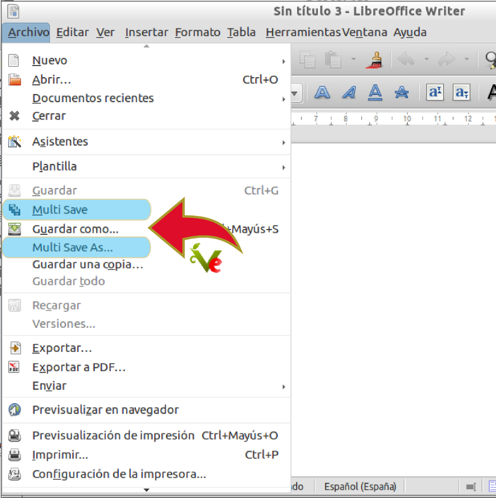

##  Tarea 5.4: Aplicaciones Ofimáticas. Extensiones de LibreOffice

**Requisitos**: *Es necesario haber leído todo lo referente a Herramientas Ofimáticas y disponer de un equipo físico con Vitalinux instalado para realizar la Tarea.*

La característica más importante de **LibreOffice** es que es **Software Libre**.  Ésto permite su instalación, uso y distribución de manera libre y colaborativa. A consecuencia de todo ello surgen otras características interesantes como la posibilidad de instalar [**Extensiones creadas por la comunidad de usuarios**](http://extensions.libreoffice.org/extension-center).

A modo de ejemplo, como tarea se propone instalar al menos una **Extensión de LibreOffice**:

1.   Abre un navegador Web y accede a la Web de **Extensiones Oficiales de LibreOffice**: <a rel="nofollow" class="external text" href="http://extensions.libreoffice.org/extension-center">**Centro de descargas de Extensiones de LibreOffice**</a> </li>
1.   Busca la extensión llamada **"MultiFormatSave"**, descárgala (*extensión \*.oxt*) e instálala (*pincha con el botón derecho del ratón sobre el archivo *.oxt descargado e indica que quieres abrirlo con **LibreOffice***).  Esta extensión permitirá a la hora de guardar un documento ofimático, guardarlo simultáneamente en los formatos de **LibreOffice** (*p.e. *.odt*), de Microsoft Office (*p.e. "*.doc"/"*.docx"*) y PDF (**.pdf*) </li>
1.   A continuación abre por ejemplo **LibreOffice Writer**, escribe algo y comprueba que en el menú **"Archivo"** aparece una nueva opción llamada **"Multi Save"**/**"Multi Save As"**</li>
1.   Selecciona la opción **"Multi Save"** e indica que quieres guardar el resultado en un subdirectorio que crearás dentro de **Documentos** llamado **misDocs**, eligiendo como nombre para el archivo tu nombre y apellidos (*p.e. Arturo_Martin_Romero*).  **¡¡¡Guárdalo en todos los formatos disponibles!!!**

    

1.   Por último, echa un vistazo a la lista de **Extensiones** disponibles para LibreOffice y comprueba si hay alguna que te puede resultar interesante.  En caso afirmativo instálala y comprueba su cometido.  Por ejemplo, si haces uso de ecuaciones matemáticas en tus clases la extensión de Libreoffice **"TexMaths"** es bestial, ya que te permite generar ecuaciones en formato Latex insuperables (*¡¡Ojo!! para usar TexMaths necesitarás instalar el programa texlive-latex-base, p.e. a través de synaptic*)

<pre style="border: 1; border-color: brown; background-color: orange; text-align: center;white-space: pre-wrap; color: white; font-weight: bold; font-size: 120%;">¡¡¡Recuerda que "LibreOffice" es "Software Libre"  disponible tanto para Linux como para Windows!!!
¡¡¡Anímate a instalar y usar "LibreOffice" si quieres evitar el uso de software ilegal/pirata tanto en tu casa como en tu centro educativo!!!</pre>

> **Formato de Entrega**: Si no encuentras muchos problemas para ello, haz capturas de pantalla (tecla IMPRIMIR PANTALLA) de todo lo que vayas haciendo. En caso de encontrar problemas para ello puedes hacer fotos directamente desde el móvil. Elabora un documento ofimático (o usa cualquier otro formato que te resulte más comodo) donde puedas incluir las capturas solicitadas y **expórtalo como pdf** para adjuntarlo como respuesta a la tarea solicitada. El nombre del fichero deberá seguir la pauta: **apellido1\_apellido2\_nombre\_TareaX.pdf**.

